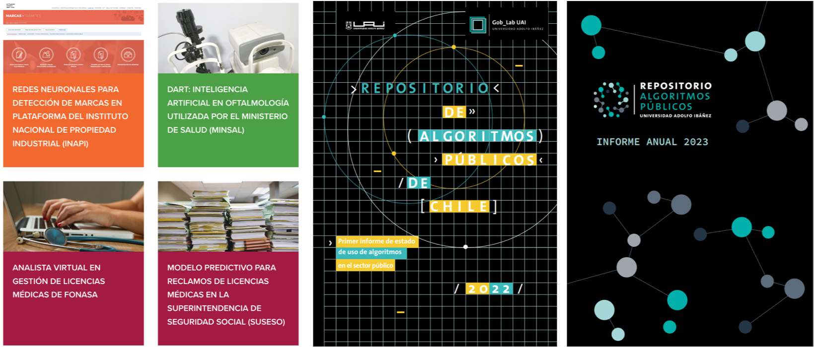

# Bienvenida al curso

## El equipo!! 🦾

::::{grid}
:gutter: 2

:::{grid-item-card} Johan 🍍
:class-body: text-center
:class-header: bg-light text-center
```{image} _static/images/jpd.png
:height: 100
:class: rounded
```
^^^
```{only} html
[](mailto:johan.pinad@autonoma.edu.co)
```
:::

:::{grid-item-card} Santiago Barrero Tabares
:class-body: text-center
:class-header: bg-light text-center
```{image} _static/images/sbt.png
:height: 100
:class: rounded
```
^^^
```{only} html
[](mailto:santiagobt1999@gmail.com)
```
:::
::::

---

::::{grid} 2
:reverse:

:::{grid-item}
:columns: 4
:class: sd-m-auto


:::

:::{grid-item}
:columns: 8
:class: sd-fs-7

**Mg. Johan Sebastián Piña Duran**

* Ingeniero Electrónico -  Universidad Autónoma de Manizales
* Ingeniero Biomédico - Universidad Autónoma de Manizales
* Magister en Bioinformática y Biología Computacional - Universidad Autónoma de Manizales
* Especialista en Deep Learning - DeepLearning.AI

% The SVG rendering breaks latex builds for the GitHub badge, so only include in HTML

```{only} html
[](https://github.com/BioAITeamLearning)
[](https://scholar.google.es/citations?hl=es&user=XLIIhSQAAAAJ)
```

:::

::::

---

### Proyecto de repositorio de algoritmos éticos


<a href="https://www.algoritmospublicos.cl/">
    
</a>

---

## Objetivos del curso:

Introducir a los estudiantes en el uso del lenguaje de programación Python para el manejo de datos relacionados al ámbito de las ciencias sociales y las políticas públicas. Al terminar este curso, el estudiante será capaz de resolver problemas por medio de algoritmos y lógica computacional, importar datos desde distintas fuentes, manipular y transformar información, hacer análisis descriptivos, visualizar campos de interés, y exportar resultados.

---

## Contenido del curso

::::{grid} 1 1 2 3
:class-container: text-center
:gutter: 3

:::{grid-item-card}
:link: Introduccion
:link-type: doc
:class-header: bg-light

**Unidad 1 🤝**
^^^

Introducción al python, tipos de datos y sintaxis
:::

:::{grid-item-card}
:link: Tema_1_2_Sentencias_libs_text_list_dict_inputs_Condicionales_10_08_2023
:link-type: doc
:class-header: bg-light

**Unidad 2 🐍**
^^^

Sentencias, librerías, cadenas de texto, estructuras de datos, I/O y condicionales
:::

:::{grid-item-card}
:link: Tema_1_3_Estruct_repetitivas_funciones_10_08_2023
:link-type: doc
:class-header: bg-light

**Unidad 3 🌀**
^^^
Estructuras repetitivas/iterativas y funciones
:::

:::{grid-item-card}
:link: Tema_2_Numpy_Matplotlib_10_08_2023
:link-type: doc
:class-header: bg-light

**Unidad 4 🚀**
^^^

Manejo de arreglos con Numpy y manejo de gráficos con Matplotlib
:::

:::{grid-item-card}
:link: Tema_3_Pandas_10_08_2023
:link-type: doc
:class-header: bg-light

**Unidad 5 🐼**
^^^

Manejo de archivos con Pandas y Gestión de archivos
:::

::::

---

## Información del curso

La forma de evaluar este curso es mediante las Tareas y talleres propuestas durante las clases

---

## Bibliografía
Estas son algunas de las referencias usadas para este curso, vuelve pronto para encontrar más contenido.

::::{card-carousel} 3

:::{card}
:margin: 3
:class-body: text-center
:class-header: bg-light text-center

```{image} https://images.cdn1.buscalibre.com/fit-in/360x360/9b/60/9b604c0a5d8f77c64be6bf1318c9eb59.jpg
:height: 300
```

:::

:::{card}
:margin: 3
:class-body: text-center
:class-header: bg-light text-center

```{image} https://images-na.ssl-images-amazon.com/images/I/91QBEYSpnLL._AC_UL600_SR600,600_.jpg
:height: 300
```
:::

:::{card}
:margin: 3
:class-body: text-center
:class-header: bg-light text-center

```{image} https://images.cdn2.buscalibre.com/fit-in/360x360/50/19/6a7d4496c65bdf02a732d20e3cf12c3d.jpg
:height: 300
```

:::

:::{card}
:margin: 3
:class-body: text-center
:class-header: bg-light text-center

```{image} https://img.tradepub.com/free/w_webd14/images/w_webd14c8.jpg
:height: 300
```

:::

:::{card}
:margin: 3
:class-body: text-center
:class-header: bg-light text-center

```{image} https://ipython.org/_images/ipython-cookbook-2nd.png
:height: 300
```
:::

::::

---

## Reglas de Juego 🕹️📏

* Clases magistrales para conceptualización del tema.
* Actividades y Talleres

---

## ¿Qué vamos a ver durante el curso?

```{tableofcontents}
```